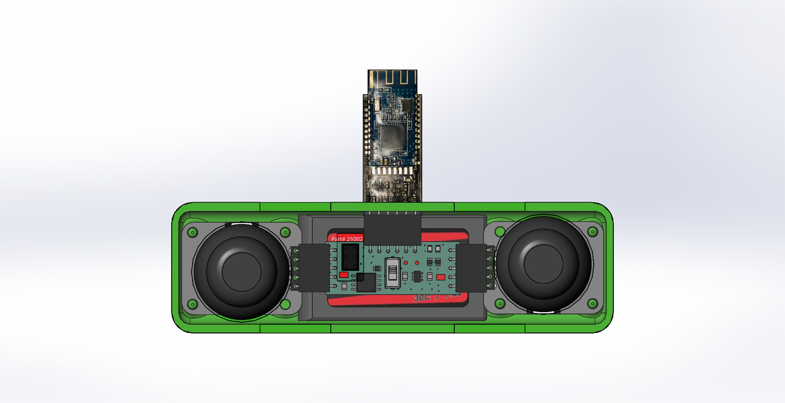

# Bluetooth-RC-Car
### Bluetooth RC Car project for ECE 196 course

#### About:
This project is to create a bluetooth radio-controlled car. The PCB for the vehicle and remote was created and designed with EAGLE. It was then programmed using Arduino. The remote casing and vehicle parts were created and assembled in SolidWorks. Some parts were 3D printed and others laser cut.

##### Vehicle:

##### Remote:

##### Final:

